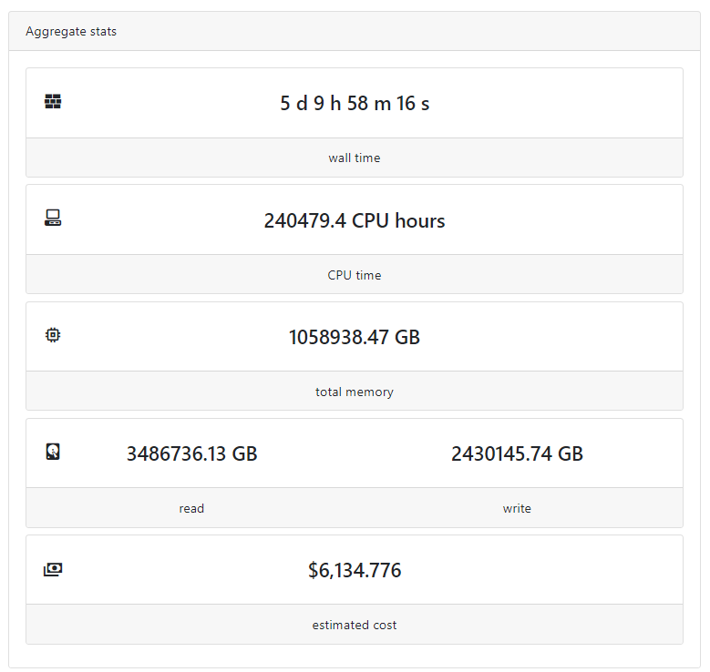
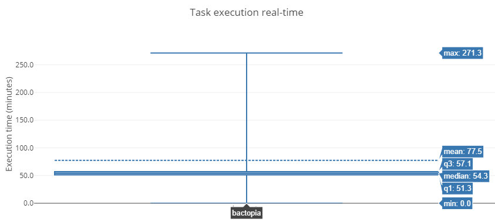

In 5 days, I processed 67,000 *Staphylococcus aureus* genomes using [Bactopia](https://bactopia.github.io/) and Amazon Web Services (AWS).
5 days! What would have taken 6 months using our local resources, was done in less than a week's time. 

For this post, I hope to demonstrate that Bactopia can use AWS to process thousands of genomes reliably and cost effectively. I'll give run down of how I went from testing a few jobs locally to submitting 67,000 jobs to AWS Batch. I will also, give a break down of the costs associated with using AWS.

So, let's get started!

## Getting Started

### Acquiring *S. aureus* Genome List
A great thing about Bactopia is you can feed it Sequence Read Archive Experiment (e.g. SRX0000001) as an input. Bactopia will take that accession, download the FASTQs and start processing them. Even better you can use `bactopia search` to [generate the list of accessions](https://bactopia.github.io/usage-basic/#generating-accession-list). So in order to get a list of *S. aureus* publicly available genomes, I used the following command:

```bash
bactopia search "Staphylococcus aureus" --prefix saureus
```

From this command 3 files are created, one of those was `saureus-accessions.txt` which contained the full list of SRA Experiment accessions that were labeled as *S. aureus*. This accessions file could then be used by Bactopia, like this:

```bash
bactopia --accessions saureus-accessions.txt
```

### Getting Setup for AWS Batch
Bactopia is built using Nextflow, which natively supports many different [job executors](https://www.nextflow.io/docs/latest/executor.html). With a simple parameter change (e.g. `-profile slurm`) Nextflow will handle submitting jobs to the specified executor. One of the supported executors is [AWS Batch](https://aws.amazon.com/batch/) which allows you to submit jobs directly to AWS without having to manage a cluster.

In order to get started using AWS Batch with Nextflow, I followed Dr. Anthony Underwood's *[Running Nextflow on AWS Batch](https://antunderwood.gitlab.io/bioinformant-blog/posts/running_nextflow_on_aws_batch/) and Tobias Neumann's *[Pipelines on AWS](https://t-neumann.github.io/pipelines/AWS-pipeline/). After going through these posts, there really isn't much I can add to the setup process that they don't already thoroughly cover.

After making it through these posts, I was ready to take my list of accessions and start testing things out.

## The Testing Phase

### Phase 1: Does Bactopia work on AWS Batch?
Short answer, it did not! In developing Bactopia, my testing had mostly been done on a Linux machine using Conda or a SLURM cluster with Singularity images. I had never actually tested Bactopia on AWS Batch and I already had all the Docker containers available. So, I gave it a go and quickly learned a few things. 

  1) AWS Batch did not like my extensive use of symbolic links
  2) Sometimes a process would start before all inputs were staged
  3) Pulling in Docker containers was a time sink

#1 was easy enough to solve, in cases where I was passing a symbolic link I added a [check choose to copy or create a link](https://github.com/bactopia/bactopia/blob/master/templates/estimate_genome_size.sh#L87-L105). 

#2 was a [known issue](https://github.com/nextflow-io/nextflow/issues/1107) that would occur when an EC2 made too many S3 requests. This required me to write a [script](https://github.com/bactopia/bactopia/blob/master/bin/check_staging.py) that would verify all input files were available and if not exit and retry the process.

#3 was an issue because Bactopia makes use of a 12 different Docker containers. For each container it was taking 1-4 minutes to pull the container from DockerHub to AWS. Bactopia has 29 different processes, so that is 29 container pulls or 29-116 minutes per genome of just pulling containers. Not cool!

I solved the first two issues, and set the Docker issue to the side. I was able to process genomes (yay!), but they seemed to be kind of slow. For a random set of 100 genomes, it was taking 3-4 hours to complete and failed jobs still occurred because of the unstaged file check would reach a max retry.

This led me back to the drawing board.

### Phase 2: Could I use SLURM on AWS?
AWS Batch was nice, but the speed was not the best and the file staging was causing too many failures. Given I knew Bactopia worked on SLURM, a quick Google search for *"SLURM on AWS"* brought me to [AWS ParallelCluster](https://aws.amazon.com/hpc/parallelcluster/). Which is a tool that would build a SLURM cluster on AWS for you. It would also automate NFS shares across nodes using EBS volumes and allow me to bypass the whole S3 unstaged file situation (yay!).

After getting ParallelCluster going, I set up all the datasets, imported Singularity images, and was off testing again. I ran a single genome through, it worked great! It was quick and smooth. I then launched another job, this time with 100 genomes. It failed due to there being no more available spot instances in my availability zone. That's weird? Ok, so I thought I would change availability zones. In order to do so, this required shutting down the cluster and creating a new one. Even better, ParallelCluster randomly chooses availability zones and does not allow you to choose. So guess what? I got the same availability zone! Haha I played the random game a few times, finally got a different zone, and restarted the setup process again.

All set up, new zone, let's go! ... *no more spot-instances available* Well, that's annoying, lets try different instance type. *no more spot-instances available* ... hmmm, well I guess another zone? I eventually edited ParallelCluster to force an availability zone, and tried all of the us-east-1 zones. In every zone, no matter the instance type I tried, I eventually got the *no more spot-instances available* error. This error was not due to limits on my AWS account, which is kind of unfortunate because that would have been an easy fix.

I was really rooting for ParallelCluster, but at the end of the day it just didn't work out. So it was back to AWS Batch.

### Phase 3: How can I pull Docker containers faster?
Now that I was back on AWS Batch, I decided it was time to solve the Docker container pull time issue. Because 30-120 minutes to just pull in containers for a single genome is an obscene amount of wasted time. So I had a few options, put the containers on the AWS Elastic Container Registry (ECR) or create an Amazon Machine Image (AMI) to "pre-pull" them. I thought about using ECR, but it required authentication to pull images (unless I missed something) so I went the custom AMI route.

This process was a lot of trial and error. To make matters a little more tedious, AMIs cannot be changed on existing AWS Batch compute environments. So each new AMI required a new compute environment to be set up.

I tried, pre-building Conda environments:
```bash
# Problematic frame:
# C  [libc.so.6+0x14b35f][thread 3959 also had an error]
  __memmove_avx_unaligned_erms+0x4f
```

I tried, Singularity in Docker:
```bash
env: 'singularity': No such file or directory (Fixed: added to container)
ERROR  : Failed to unshare root file system: Operation not permitted (tried --priveledged)
```

I tried, Docker in Docker:
```bash
.command.run: line 259: docker: command not found (Fixed: installed docker on container)
docker: Cannot connect to the Docker daemon at unix:///var/run/docker.sock. \
        Is the docker daemon running?. (Fixed: Mounted /var/run/docker)
/bin/bash: .command.run: No such file or directory
```

Don't judge! It was late and I was trying to make it work! 

Eventually, I went back to the Conda error. After some digging... *sigh* It was a simple fix, the issue was related to building the Conda environments on an Intel-based instance then trying to run them on an AMD-based instance. My solution? Don't mix Intel and AMD, since there were more Intel instance options I only used Intel-based instances. 

After [creating the custom AMI](https://gist.github.com/rpetit3/01f27f52273104bbf609ed5acc9b63a9) and an [AWS Batch Docker container](https://github.com/bactopia/bactopia/blob/master/.awsbatch.Dockerfile), it took less than 30 seconds to pull in the Docker container. Problem solved! Back to testing.

Things were much faster! But soon enough, the unstaged file issue continued to pop up. It really became an issue when I was trying to run tests with 1,000 genomes. I tried reducing the maximum number of transfers, adding 25 retries but the issue would still pop up.

### Phase 4: How can I reduce S3 transfers?
Bactopia has lots of files being moved between processes, so for AWS Batch there are always numerous files being uploaded and downloaded. At this point, I fell back on my experience processing 40k genomes for Staphopia. For Staphopia, I used a wrapper (Python) around the Nextflow pipeline to run everything on a single instance and create a final tarball of the results. Except for Bactopia, I created a [Nextflow workflow around Bactopia](https://gist.github.com/rpetit3/fe1f5428be135852ec90bfb63aa32c93), a *Nexflowception* if you will!

This was the solution! With this wrapper, a genome was processed from start to finish on a single instance and only the final tarball of the results was uploaded to S3. All the intermediate files were never uploaded to S3 as was the case in using the non-wrapper approach.

A consequence of this approach was I couldn't really take advantage of Nextflow's queue manager. I had to limit each genome to 4 cores and 16GB of memory. Otherwise, AWS Batch would end up setting aside a lot of resources that weren't being used efficiently.

During all this testing, I tested ~5,000 genomes (only ~2,000 unique) and got a really good idea of the cost per genome expected runtime/compute requirements. At this point, it was time to start processing all the genomes. Every one of them.

## The Launch Phase
Honestly there isn't much to say here, a lot happened but at the same time not much happened. I had planned to submit genomes in batches of 5,000 or so, but I decided "what the heck?" and instead submitted the remaining 65,000 genomes all at once. I also used [Nextflow Tower](https://tower.nf/) to track the progress, which made it more fun and easy to track.

For the next 5 days, genomes were processed and and it all went as smooth as you could hope for.

*And, then it was done.*

Since I used Nextflow and Nextflow Tower I was able to get some pretty nice stats associated with jobs. In the simplest terms, I used a crap ton of resources over those 5 days!




Nearly all jobs took around 55 minutes to complete using only 4-cores and 16GB of memory. 




## How much did it cost?
So, how much did it cost to use AWS? *$12,408 (USD)*

This cost was for testing and processing all 67,000 genomes. When I add up the testing and final processing I probably processed close to 70,000 genomes, which comes out to ~$0.18 (USD) to process a *S. aureus* genome using Bactopia and AWS Batch. Here is the break down of costs.


| AWS Charge                  | Usage Estimate    | Cost USD (%) | Cost Per Genome |
|-----------------------------|-------------------|--------------|:---------------:|
| Elastic Compute Cloud (EC2) | 258,670 CPU hours | $7,552 (61%) | $0.11           |
| Data Transfer               | 42 TB             | $3,566 (29%) | $0.05           |
| Simple Storage Service (S3) | 84 TB             | $1,286 (10%) | $0.02           |
| Cloud Watch                 | 9 GB              | $4 (0%)      | $0.00           |

The bulk of the cost was compute costs, which was about $0.11 per genome. The remaining costs, $0.07, were associated with the storage and transfer of data. I do think there is room to reduce these costs per genome. 

In 2017, I was able to process *S. aureus* genomes for $0.05 per genome using Staphopia on the [Cancer Genomics Cloud (CGC)](https://www.cancergenomicscloud.org/). Staphopia and Bactopia have very similar runtimes and compute requirements (~50 minutes, 4-cores, 16GB memory). I think optimizing EC2 spot-instance types, such as using only smaller ones, could potentially cut the compute costs in half. 

You might have noticed, my S3 storage (84TB) is double my data transfer (42 TB). This is due to how I told Nextflow to output the results. If I had told Nextflow to link the result instead of copying, I could have easily cut the S3 storage in half, saving ~$640. 

Unfortunately, there is very little room to reduce data transfer costs. In my case I was already only downloading a gzipped (`--best`) tarball of all the results per sample. I could have reduced the tarball size by removing some of the result files (FASTQs or BAMs). But, to regenerate these files again would have taken a considerable amount of time. So, for me at least, it made more sense to not delete any of the results and keep them all in the final tarball. 

In the end, with a few tweaks, I could have potentially reduced the costs from $0.18/genome down to $0.11/genome, with roughly half of the $0.11 being just data transfer costs. 

Although, the cost savings would have come with a hit on total processing time. It's likely by using only small instance types, the total processing time would have taken multiple weeks. Given I was in a deadline, I think completing everything in less than a week was a fair trade off.

Fortunately, all the costs, except $60, were covered by an [AWS Cloud Credits for Research](https://aws.amazon.com/research-credits/) award.

## So, what's next?
The plan for these data to become the basis for Staphopia V2. At the time of writing this, I am still in the midst of transferring data between servers (gotta have those backups!), so we haven't actually gotten the chance to start digging into the data. So, stand by! It's coming soon!
